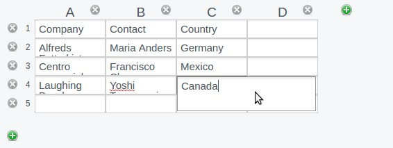

# silverstripe-table-field

Allows to edit tables in wysiwyg style. Saves the result in json.




## Installation

```sh
composer require nblum/silverstripe-table-field
```

## Usage

In model

    private static $db = [
        'Table' => 'Varchar',
    ];

    public function getCMSFields()
    {
        $fields = parent::getCMSFields();

        $fields->addFieldsToTab('Root.Main', [
            TableField::create('Table', 'Table')
        ]);

        return $fields;
    }

    public function Table()
    {
        return new ArrayList(array_reduce(json_decode($this->dbObject('Table')->value), function ($carry, $row) {
            $carry = is_array($carry) ? $carry : [];
            return array_merge($carry, [['row' => new ArrayList(array_reduce($row, function($carry, $column) {
                $carry = is_array($carry) ? $carry : [];
                return array_merge($carry, [['column' => $column]]);
            }))]]);
        }));
    }

In template

    <table>
        <% loop $Table %>
            <tr>
                <% loop $row %>
                    <%-- Using .RAW lets us but <b> tags in the table fields --%>
                    <td>$column.RAW</td>
                <% end_loop %>
            </tr>
        <% end_loop %>
    </table>

## Configuration
There are no configuration options


## Todos

- add config options for max rows and cols